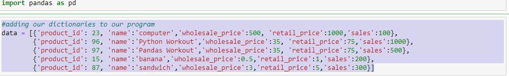
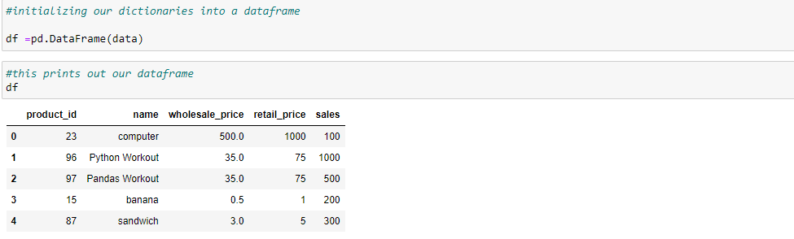
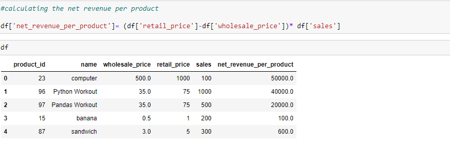
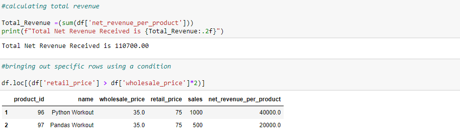
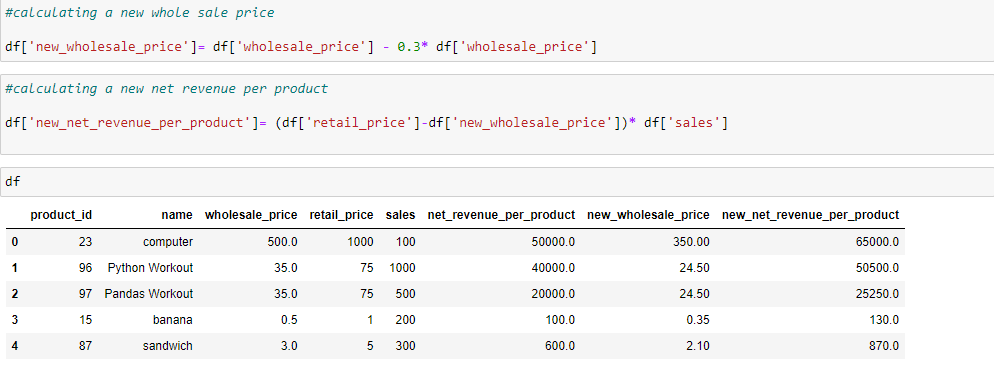

# Dataframes
## Creating DataFrames in python

## What is  a DataFrame?
A DataFrame is a data structure that organizes data into a 2-dimensional table of rows and columns, much like a spreadsheet. DataFrames are one of the most common data structures used in modern data analytics because they are a flexible and intuitive way of storing and working with data.

The project below is using pandas to organize a Store's data.

The next stage shows how we initialize our dictonaries into a dataframe

We move on to calculating the net revenue per product

Calculating total revenues and bringing out specific rows using a condition is shown in the image below

Lastly, we calculate the new whole sale price and a new net revenue per product

